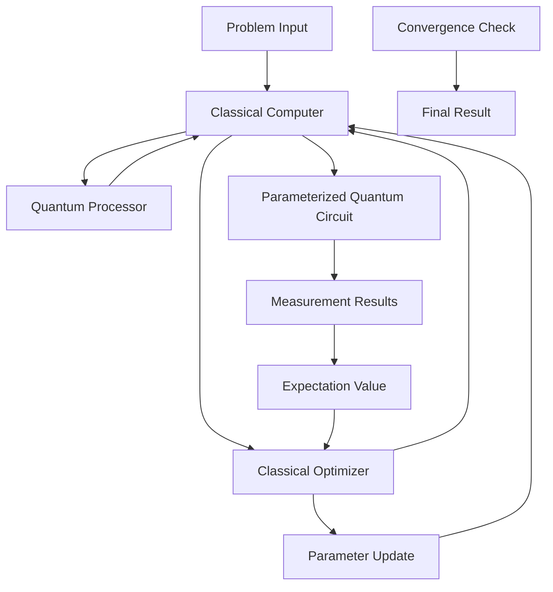

# 🔄 Hybrid Algorithms Guide - Руководства по Реализации

## Обзор

Этот guide содержит подробные руководства по реализации и использованию гибридных квантово-классических алгоритмов в x0tta6bl4 Unified Platform. Гибридные алгоритмы сочетают преимущества квантовых вычислений с мощностью классических оптимизаторов.

## Архитектура Гибридных Алгоритмов



### Ключевые Компоненты

1. **Классический оптимизатор** - управляет параметрами квантовой цепи
2. **Параметризованная квантовая цепь** - ansatz для аппроксимации решения
3. **Измерения** - получение статистических данных с квантового устройства
4. **Expectation values** - вычисление целевой функции

## VQE (Variational Quantum Eigensolver) - Подробное Руководство

### Теоретическая Основа

VQE минимизирует expectation value ⟨ψ(θ)| H |ψ(θ)⟩ путем варнационной оптимизации параметров θ параметризованного состояния |ψ(θ)⟩.

### Шаг 1: Определение Проблемы

```python
# Пример: Вычисление основного состояния молекулы H2
from qiskit_nature import Molecule
from qiskit_nature.drivers import PySCFDriver

# Определение молекулы
molecule = Molecule(geometry=[['H', [0., 0., 0.]],
                             ['H', [0., 0., 0.735]]],
                   charge=0, multiplicity=1)

driver = PySCFDriver()
problem = driver.run()
hamiltonian = problem.hamiltonian
```

### Шаг 2: Выбор Ansatz

```python
from qiskit.circuit.library import TwoLocal

# Hardware-efficient ansatz
ansatz = TwoLocal(rotation_blocks=['ry', 'rz'],
                 entanglement_blocks='cz',
                 entanglement='full',
                 reps=2)

print(f"Ansatz parameters: {ansatz.num_parameters}")
print(f"Circuit depth: {ansatz.depth()}")
```

### Шаг 3: Настройка Оптимизатора

```python
from qiskit.algorithms.optimizers import COBYLA, SPSA

# COBYLA для гладких функций
cobyla = COBYLA(maxiter=200, tol=1e-6)

# SPSA для шумных функций
spsa = SPSA(maxiter=300, last_avg=10)
```

### Шаг 4: Запуск VQE

```python
from qiskit.algorithms import VQE
from qiskit.utils import QuantumInstance

# Настройка quantum instance
backend = BasicAer.get_backend('qasm_simulator')
quantum_instance = QuantumInstance(backend, shots=8192)

# Создание VQE инстанса
vqe = VQE(ansatz=ansatz, optimizer=cobyla, quantum_instance=quantum_instance)

# Запуск оптимизации
result = vqe.compute_minimum_eigenvalue(hamiltonian)

print(f"Ground state energy: {result.eigenvalue}")
print(f"Optimal parameters: {result.optimal_parameters}")
```

### Шаг 5: Анализ Результатов

```python
# Проверка сходимости
print(f"Optimizer result: {result.optimizer_result}")
print(f"Cost function evaluations: {result.cost_function_evals}")

# Визуализация сходимости
import matplotlib.pyplot as plt

plt.plot(result.optimizer_result['cost_history'])
plt.xlabel('Iteration')
plt.ylabel('Energy')
plt.title('VQE Convergence')
plt.show()
```

## QAOA (Quantum Approximate Optimization Algorithm)

### Применение к Max-Cut Problem

#### Шаг 1: Определение Графа

```python
import networkx as nx

# Создание графа
G = nx.Graph()
G.add_edges_from([(0,1), (1,2), (2,3), (3,0), (1,3)])

# Визуализация
nx.draw(G, with_labels=True)
plt.show()
```

#### Шаг 2: Создание Cost Hamiltonian

```python
from qiskit.quantum_info import SparsePauliOp
import numpy as np

def create_maxcut_hamiltonian(graph):
    """Создание гамильтониана для Max-Cut проблемы"""
    n = len(graph.nodes)
    hamiltonian = SparsePauliOp.from_list([])

    # Cost term: -∑_{(i,j)∈E} (Z_i Z_j)
    for i, j in graph.edges():
        pauli_str = ['I'] * n
        pauli_str[i] = 'Z'
        pauli_str[j] = 'Z'
        hamiltonian += SparsePauliOp.from_list([(''.join(pauli_str), -1.0)])

    return hamiltonian

cost_hamiltonian = create_maxcut_hamiltonian(G)
```

#### Шаг 3: Создание Mixer Hamiltonian

```python
def create_mixer_hamiltonian(n_qubits):
    """Создание стандартного mixer гамильтониана"""
    mixer_terms = []
    for i in range(n_qubits):
        pauli_str = ['I'] * n_qubits
        pauli_str[i] = 'X'
        mixer_terms.append((''.join(pauli_str), 1.0))

    return SparsePauliOp.from_list(mixer_terms)

mixer_hamiltonian = create_mixer_hamiltonian(len(G.nodes))
```

#### Шаг 4: Реализация QAOA

```python
from qiskit.algorithms import QAOA

# Настройка QAOA
qaoa = QAOA(optimizer=COBYLA(maxiter=100), reps=2,
           quantum_instance=quantum_instance)

# Запуск оптимизации
result = qaoa.compute_minimum_eigenvalue(cost_hamiltonian)

print(f"Optimal cut value: {-result.eigenvalue}")
print(f"Optimal parameters: {result.optimal_parameters}")
```

#### Шаг 5: Извлечение Решения

```python
# Получение наиболее вероятного решения
optimal_circuit = qaoa.construct_circuit(result.optimal_parameters, cost_hamiltonian)[0]
counts = quantum_instance.execute(optimal_circuit).get_counts()

# Преобразование в решение Max-Cut
most_frequent = max(counts, key=counts.get)
solution = [int(bit) for bit in most_frequent[::-1]]  # Qiskit использует little-endian

print(f"Solution: {solution}")
print(f"Cut value: {evaluate_cut(G, solution)}")
```

## Гибридные Оптимизации

### Parameter Optimization Strategies

#### 1. Gradient-based Optimization

```python
from qiskit.algorithms.optimizers import GradientDescent

# Использование градиентов для ускорения сходимости
gradient_optimizer = GradientDescent(maxiter=100, learning_rate=0.1)

vqe_gradient = VQE(ansatz=ansatz, optimizer=gradient_optimizer,
                   quantum_instance=quantum_instance)
```

#### 2. Noise-aware Optimization

```python
from qiskit.algorithms.optimizers import SPSA

# SPSA для шумных квантовых устройств
spsa_optimizer = SPSA(maxiter=200, last_avg=25, c=0.1, trust_region=False)

vqe_noise = VQE(ansatz=ansatz, optimizer=spsa_optimizer,
                quantum_instance=quantum_instance)
```

#### 3. Multi-start Optimization

```python
def multi_start_vqe(hamiltonian, ansatz, n_starts=10):
    """Многостартовый VQE для избежания локальных минимумов"""
    best_result = None
    best_energy = float('inf')

    for i in range(n_starts):
        # Случайная инициализация параметров
        initial_params = np.random.uniform(-np.pi, np.pi, ansatz.num_parameters)

        vqe = VQE(ansatz=ansatz, optimizer=COBYLA(maxiter=50),
                 quantum_instance=quantum_instance)

        result = vqe.compute_minimum_eigenvalue(hamiltonian)

        if result.eigenvalue < best_energy:
            best_energy = result.eigenvalue
            best_result = result

    return best_result
```

### Circuit Optimization Techniques

#### 1. Ansatz Selection

```python
from qiskit.circuit.library import EfficientSU2, RealAmplitudes

# EfficientSU2 для hardware-efficient ansatz
efficient_ansatz = EfficientSU2(n_qubits=4, reps=2)

# RealAmplitudes для problem-inspired ansatz
real_amp_ansatz = RealAmplitudes(n_qubits=4, reps=2)

# Сравнение expressibility
print(f"EfficientSU2 params: {efficient_ansatz.num_parameters}")
print(f"RealAmplitudes params: {real_amp_ansatz.num_parameters}")
```

#### 2. Circuit Compilation

```python
from qiskit import transpile

# Оптимизация цепи для конкретного бэкенда
transpiled_ansatz = transpile(ansatz, backend=backend,
                            optimization_level=3,
                            basis_gates=backend.configuration().basis_gates)

print(f"Original depth: {ansatz.depth()}")
print(f"Transpiled depth: {transpiled_ansatz.depth()}")
print(f"Gate count: {transpiled_ansatz.count_ops()}")
```

#### 3. Error Mitigation

```python
from qiskit.algorithms import Estimator
from qiskit.providers.fake_provider import FakeVigo

# Использование error mitigation
backend = FakeVigo()
estimator = Estimator(backend=backend)

# VQE с error mitigation
vqe_mitigated = VQE(estimator=estimator, optimizer=cobyla, ansatz=ansatz)
```

## Продвинутые Техники

### Warm-start QAOA

```python
def warm_start_qaoa(cost_hamiltonian, initial_solution):
    """QAOA с warm start от классического решения"""
    n_qubits = cost_hamiltonian.num_qubits

    # Создание начального состояния на основе решения
    initial_state = QuantumCircuit(n_qubits)
    for i, bit in enumerate(initial_solution):
        if bit == 1:
            initial_state.x(i)

    # Преобразование в суперпозицию
    for i in range(n_qubits):
        initial_state.ry(np.pi/2, i)  # Создание суперпозиции |+⟩

    # Добавление warm-start слоя
    warm_ansatz = initial_state.compose(ansatz)

    return warm_ansatz
```

### Adaptive Circuit Construction

```python
class AdaptiveVQE:
    """Адаптивный VQE с динамическим построением цепи"""

    def __init__(self, hamiltonian, threshold=0.1):
        self.hamiltonian = hamiltonian
        self.threshold = threshold
        self.ansatz = QuantumCircuit(hamiltonian.num_qubits)

    def grow_ansatz(self, gradients):
        """Добавление гейтов на основе градиентов"""
        max_gradient_idx = np.argmax(np.abs(gradients))

        # Добавление параметризованного гейта
        if max_gradient_idx % 2 == 0:
            self.ansatz.ry(0, max_gradient_idx // 2)
        else:
            self.ansatz.rz(0, max_gradient_idx // 2)

        return self.ansatz
```

## Интеграция с Классическими Алгоритмами

### Quantum-enhanced Machine Learning

```python
from qiskit_machine_learning.algorithms import QSVC
from qiskit_machine_learning.kernels import QuantumKernel

# Quantum kernel для SVM
quantum_kernel = QuantumKernel(feature_map=ansatz, quantum_instance=quantum_instance)

# Quantum Support Vector Classifier
qsvc = QSVC(quantum_kernel=quantum_kernel)

# Обучение на данных
qsvc.fit(X_train, y_train)
predictions = qsvc.predict(X_test)
```

### Hybrid Optimization Workflows

```python
def hybrid_optimization_workflow(problem):
    """Гибридный workflow: классический + квантовый"""

    # Шаг 1: Классическая оптимизация для начального решения
    classical_solution = classical_optimizer(problem)

    # Шаг 2: Quantum refinement
    quantum_refinement = qaoa_refine(classical_solution, problem)

    # Шаг 3: Final classical polishing
    final_solution = classical_polish(quantum_refinement)

    return final_solution
```

## Мониторинг и Отладка

### Performance Metrics

```python
def monitor_vqe_performance(vqe_result):
    """Мониторинг производительности VQE"""

    metrics = {
        'final_energy': vqe_result.eigenvalue,
        'convergence_iterations': len(vqe_result.optimizer_result['cost_history']),
        'total_evaluations': vqe_result.cost_function_evals,
        'optimizer_time': vqe_result.optimizer_time,
        'quantum_time': vqe_result.quantum_time
    }

    # Анализ сходимости
    cost_history = vqe_result.optimizer_result['cost_history']
    convergence_rate = analyze_convergence(cost_history)

    return {**metrics, **convergence_rate}
```

### Debugging Techniques

```python
def debug_quantum_circuit(circuit, hamiltonian):
    """Отладка квантовой цепи"""

    # 1. Проверка корректности цепи
    print(f"Circuit valid: {circuit.num_qubits == hamiltonian.num_qubits}")

    # 2. Анализ глубины и сложности
    print(f"Circuit depth: {circuit.depth()}")
    print(f"Gate counts: {circuit.count_ops()}")

    # 3. Тестирование на симуляторе
    simulator = BasicAer.get_backend('qasm_simulator')
    test_result = execute(circuit, simulator, shots=1024).result()

    return test_result
```

## Лучшие Практики

### 1. Выбор Ansatz
- **Hardware-efficient:** Для NISQ устройств
- **Problem-specific:** Для известных структур проблемы
- **UCC-based:** Для квантовой химии

### 2. Оптимизация Производительности
- **Circuit optimization:** Минимизация глубины и числа гейтов
- **Parameter initialization:** Использование domain knowledge
- **Error mitigation:** Калибровка и коррекция ошибок

### 3. Масштабируемость
- **Problem decomposition:** Разбиение больших проблем
- **Distributed execution:** Параллельные вычисления
- **Resource management:** Оптимизация использования кубитов

## Примеры Приложений

### Квантовая Химия

```python
# VQE для молекулы H2
from qiskit_nature.second_q.algorithms import GroundStateEigensolver

# Полная настройка для квантовой химии
solver = GroundStateEigensolver(ansatz, optimizer, quantum_instance)
result = solver.solve(problem)

print(f"Molecular ground state: {result.ground_state_energy}")
```

### Финансовая Оптимизация

```python
# QAOA для portfolio optimization
def portfolio_qaoa(assets, constraints):
    """QAOA для оптимизации портфеля"""

    # Создание cost function
    cost_hamiltonian = create_portfolio_hamiltonian(assets, constraints)

    # Запуск QAOA
    qaoa = QAOA(optimizer=SPSA(), reps=3)
    result = qaoa.compute_minimum_eigenvalue(cost_hamiltonian)

    return extract_portfolio_allocation(result)
```

### Комбинаторная Оптимизация

```python
# QAOA для traveling salesman problem
def tsp_qaoa(cities, distances):
    """QAOA для задачи коммивояжера"""

    # Кодирование проблемы в гамильтониан
    hamiltonian = encode_tsp_hamiltonian(cities, distances)

    # Решение с QAOA
    solution = qaoa_solver(hamiltonian)

    return decode_tsp_solution(solution)
```

## Troubleshooting

### Распространенные Проблемы

1. **Barren plateaus**
   - **Симптом:** Медленная сходимость, плоский ландшафт
   - **Решение:** Использование structured ansatz, layer-wise training

2. **Local minima**
   - **Симптом:** Застревание в субоптимальных решениях
   - **Решение:** Multi-start optimization, basin hopping

3. **Hardware noise**
   - **Симптом:** Несогласованные результаты
   - **Решение:** Error mitigation, readout error correction

4. **Circuit depth limitations**
   - **Симптом:** Ошибки coherence
   - **Решение:** Circuit optimization, shallower ansatz

## Ресурсы и Ссылки

- [Qiskit Tutorials](https://qiskit.org/documentation/tutorials.html)
- [PennyLane Documentation](https://pennylane.ai/)
- [Cirq Guides](https://quantumai.google/cirq)
- [VQE Review Paper](https://arxiv.org/abs/2111.05176)
- [QAOA Applications](https://arxiv.org/abs/1812.01041)

## Контакты

- **Technical Support:** quantum-support@x0tta6bl4.com
- **Research Collaboration:** quantum-research@x0tta6bl4.com
- **Documentation Issues:** docs@x0tta6bl4.com