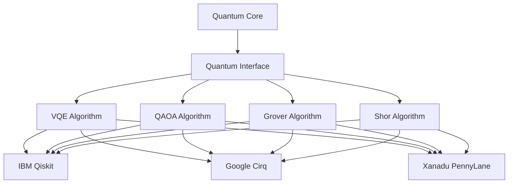

# 🔬 Quantum Algorithms API Documentation

## Обзор

Этот документ содержит полную API документацию для quantum algorithms в x0tta6bl4 Unified Platform. API предоставляет доступ к четырем основным квантовым алгоритмам: VQE, QAOA, Grover и Shor.

## Базовая Архитектура



## API Endpoints

### Quantum Core Status

#### `GET /api/v1/quantum/status`

Получение статуса квантового core и доступных провайдеров.

**Response:**
```json
{
  "name": "quantum_core",
  "status": "operational",
  "active_provider": "ibm",
  "providers": {
    "ibm": {
      "available": true,
      "healthy": true
    },
    "google": {
      "available": true,
      "healthy": true
    },
    "xanadu": {
      "available": true,
      "healthy": true
    }
  },
  "algorithms": ["vqe", "qaoa", "grover", "shor"],
  "healthy": true
}
```

### VQE (Variational Quantum Eigensolver)

#### `POST /api/v1/quantum/vqe`

Запуск алгоритма VQE для поиска основного состояния гамильтониана.

**Request Body:**
```json
{
  "hamiltonian": {
    "type": "molecular",
    "molecule": "H2",
    "basis_set": "sto-3g"
  },
  "ansatz": {
    "type": "UCCSD",
    "layers": 2
  },
  "optimizer": {
    "type": "COBYLA",
    "max_iterations": 100,
    "tolerance": 1e-6
  },
  "shots": 8192
}
```

**Response:**
```json
{
  "algorithm": "vqe",
  "provider": "ibm",
  "eigenvalue": -1.851,
  "optimal_parameters": [0.123, 0.456, 0.789],
  "execution_time": 45.67,
  "success": true,
  "convergence": {
    "iterations": 87,
    "final_energy": -1.851,
    "gradient_norm": 1.2e-7
  }
}
```

**Параметры:**
- `hamiltonian`: Описание квантового гамильтониана
- `ansatz`: Варнационная форма волновой функции
- `optimizer`: Классический оптимизатор параметров
- `shots`: Количество измерений для оценки expectation values

### QAOA (Quantum Approximate Optimization Algorithm)

#### `POST /api/v1/quantum/qaoa`

Запуск алгоритма QAOA для решения задач комбинаторной оптимизации.

**Request Body:**
```json
{
  "cost_hamiltonian": {
    "type": "max_cut",
    "graph": {
      "nodes": [0, 1, 2, 3],
      "edges": [[0, 1], [1, 2], [2, 3], [3, 0]]
    }
  },
  "mixer_hamiltonian": {
    "type": "standard"
  },
  "p": 3,
  "optimizer": {
    "type": "SPSA",
    "max_iterations": 200
  }
}
```

**Response:**
```json
{
  "algorithm": "qaoa",
  "provider": "google",
  "eigenvalue": -2.847,
  "optimal_parameters": [0.785, 1.571, 0.392],
  "execution_time": 123.45,
  "success": true,
  "solution": {
    "cut_value": 3,
    "partition": [0, 1, 0, 1]
  }
}
```

### Grover Search Algorithm

#### `POST /api/v1/quantum/grover`

Запуск алгоритма Гровера для поиска в неструктурированной базе данных.

**Request Body:**
```json
{
  "oracle": {
    "marked_states": ["001", "110"],
    "search_space_size": 8
  },
  "iterations": 2
}
```

**Response:**
```json
{
  "algorithm": "grover",
  "provider": "xanadu",
  "found_states": ["001", "110"],
  "amplitudes": [0.707, 0.707],
  "execution_time": 12.34,
  "success": true,
  "iterations_used": 2
}
```

### Shor Factoring Algorithm

#### `POST /api/v1/quantum/shor`

Запуск алгоритма Шора для факторизации целых чисел.

**Request Body:**
```json
{
  "number": 21,
  "precision": 15
}
```

**Response:**
```json
{
  "algorithm": "shor",
  "provider": "ibm",
  "factors": [3, 7],
  "execution_time": 234.56,
  "success": true,
  "period_found": 6,
  "classical_verification": true
}
```

## Провайдеры и Бэкенды

### IBM Quantum (Qiskit)

**Поддерживаемые алгоритмы:** VQE, QAOA, Grover, Shor
**Бэкенд:** qasm_simulator, ibmq_qasm_simulator
**Особенности:**
- Полная поддержка всех алгоритмов
- Реальные квантовые устройства
- Продвинутые оптимизаторы

### Google Quantum (Cirq)

**Поддерживаемые алгоритмы:** VQE, QAOA, Grover, Shor
**Бэкенд:** cirq.Simulator()
**Особенности:**
- Быстрое симулирование
- Google-оптимизированные гейты
- Хорошая интеграция с TensorFlow Quantum

### Xanadu Quantum (PennyLane)

**Поддерживаемые алгоритмы:** VQE, QAOA, Grover, Shor
**Бэкенд:** default.qubit
**Особенности:**
- Градиентные вычисления
- Непрерывные переменные
- Интеграция с машинным обучением

## Ошибки и Обработка Исключений

### Стандартные Коды Ошибок

```json
{
  "error": "PROVIDER_UNAVAILABLE",
  "message": "Выбранный квантовый провайдер недоступен",
  "code": 503,
  "details": {
    "provider": "ibm",
    "retry_after": 300
  }
}
```

### Возможные Ошибки

- `PROVIDER_UNAVAILABLE`: Провайдер временно недоступен
- `INVALID_PARAMETERS`: Некорректные параметры запроса
- `EXECUTION_TIMEOUT`: Превышено время выполнения
- `INSUFFICIENT_RESOURCES`: Недостаточно квантовых ресурсов
- `HARDWARE_ERROR`: Ошибка квантового оборудования

## Аутентификация и Авторизация

API использует JWT токены для аутентификации:

```
Authorization: Bearer <jwt_token>
```

### Роли и Права

- `quantum_user`: Базовый доступ к алгоритмам
- `quantum_researcher`: Доступ к расширенным параметрам
- `quantum_admin`: Полный административный доступ

## Rate Limiting

- **Базовый лимит:** 100 запросов/час
- **Премиум:** 1000 запросов/час
- **Исследовательский:** 10000 запросов/час

## Мониторинг и Метрики

### Метрики Производительности

```json
{
  "execution_time": 45.67,
  "qubits_used": 4,
  "gates_applied": 156,
  "fidelity_estimate": 0.987,
  "error_rate": 0.003
}
```

### Health Checks

```bash
# Проверка здоровья quantum core
curl http://localhost:8000/api/v1/quantum/health

# Проверка конкретного провайдера
curl http://localhost:8000/api/v1/quantum/providers/ibm/health
```

## Примеры Использования

### Python Client

```python
import requests
import json

# Инициализация клиента
base_url = "http://localhost:8000/api/v1/quantum"

# Запуск VQE
vqe_request = {
    "hamiltonian": {"type": "molecular", "molecule": "H2"},
    "optimizer": {"type": "COBYLA"}
}

response = requests.post(f"{base_url}/vqe", json=vqe_request)
result = response.json()

print(f"Eigenvalue: {result['eigenvalue']}")
```

### JavaScript Client

```javascript
const quantumAPI = {
  baseURL: 'http://localhost:8000/api/v1/quantum',

  async runVQE(hamiltonian) {
    const response = await fetch(`${this.baseURL}/vqe`, {
      method: 'POST',
      headers: {
        'Content-Type': 'application/json',
        'Authorization': `Bearer ${this.token}`
      },
      body: JSON.stringify({ hamiltonian })
    });

    return await response.json();
  }
};
```

## Troubleshooting

### Распространенные Проблемы

1. **Provider Unavailable**
   - Проверьте статус провайдера через `/status`
   - Попробуйте другой провайдер
   - Проверьте сетевые настройки

2. **Execution Timeout**
   - Уменьшите размер проблемы
   - Выберите более быстрый провайдер
   - Оптимизируйте параметры алгоритма

3. **Low Accuracy**
   - Увеличьте количество shots
   - Используйте более глубокий ansatz
   - Проверьте параметры оптимизатора

### Debug Информация

```json
{
  "debug_info": {
    "circuit_depth": 45,
    "gate_count": 156,
    "qubit_count": 4,
    "execution_stats": {
      "compilation_time": 1.23,
      "simulation_time": 34.56,
      "optimization_time": 9.87
    }
  }
}
```

## Версионирование API

- **v1**: Текущая стабильная версия
- **v1.1**: Добавлена поддержка новых оптимизаторов (запланировано)
- **v2.0**: Полная переработка с поддержкой гибридных алгоритмов (запланировано)

## Контакты и Поддержка

- **Документация:** docs.x0tta6bl4.com/quantum-api
- **Issues:** GitHub Issues в репозитории x0tta6bl4-unified
- **Slack:** #quantum-algorithms
- **Email:** quantum-support@x0tta6bl4.com