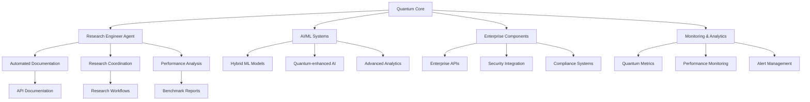

# 🔗 Quantum Integration Guide - Интеграция с Существующими Системами

## Обзор

Этот guide описывает интеграцию quantum algorithms с существующими компонентами x0tta6bl4 Unified Platform, включая Research Engineer Agent, AI системы, enterprise компоненты и monitoring инфраструктуру.

## Архитектура Интеграции



## Интеграция с Research Engineer Agent

### Автоматическая Генерация Документации

#### Настройка Research Agent для Quantum

```python
from production.research.research_engineer_agent import ResearchEngineerAgent
from production.quantum.quantum_engineer_agent import QuantumEngineerAgent

class QuantumResearchIntegration:
    def __init__(self):
        self.research_agent = ResearchEngineerAgent()
        self.quantum_agent = QuantumEngineerAgent()

    async def initialize_quantum_research(self):
        """Инициализация интеграции quantum research"""

        # Регистрация quantum агента
        await self.research_agent.register_collaborator(
            "quantum_engineer",
            self.quantum_agent
        )

        # Настройка automated documentation
        await self.setup_documentation_pipeline()

        # Инициализация research workflows
        await self.initialize_research_workflows()

    async def setup_documentation_pipeline(self):
        """Настройка автоматической генерации документации"""

        documentation_config = {
            "quantum_algorithms": {
                "api_docs": True,
                "implementation_guides": True,
                "performance_benchmarks": True,
                "integration_guides": True
            },
            "update_frequency": "weekly",
            "output_formats": ["markdown", "html", "pdf"],
            "distribution_channels": ["internal_wiki", "github_pages", "api_portal"]
        }

        await self.research_agent.configure_documentation_pipeline(documentation_config)
```

#### Research Workflow Integration

```python
async def coordinate_quantum_research_project(self, project_config):
    """Координация quantum research проекта"""

    # Определение участников
    collaborators = [
        "quantum_engineer",
        "ai_engineer",
        "research_engineer"
    ]

    # Создание research плана
    research_plan = await self.research_agent.create_research_plan({
        "topic": project_config["topic"],
        "quantum_focus": project_config["quantum_algorithms"],
        "ai_integration": project_config["ai_components"],
        "timeline": project_config["timeline"],
        "milestones": project_config["milestones"]
    })

    # Запуск координации
    coordination_result = await self.quantum_agent.coordinate_quantum_research(
        research_topic=project_config["topic"],
        collaborators=collaborators
    )

    return {
        "research_plan": research_plan,
        "coordination_status": coordination_result,
        "integration_status": "active"
    }
```

### Performance Analysis Integration

```python
async def integrated_performance_analysis(self, algorithm, test_results):
    """Интегрированный анализ производительности"""

    # Quantum метрики
    quantum_metrics = await self.quantum_agent.measure_quantum_metrics()

    # AI-powered анализ
    ai_analysis = await self.research_agent.request_ai_analysis({
        "quantum_results": test_results,
        "metrics": quantum_metrics,
        "algorithm": algorithm
    })

    # Исследовательский анализ
    research_insights = await self.research_agent.analyze_research_data({
        "performance_data": test_results,
        "quantum_metrics": quantum_metrics,
        "ai_insights": ai_analysis
    })

    return {
        "quantum_metrics": quantum_metrics,
        "ai_analysis": ai_analysis,
        "research_insights": research_insights,
        "integrated_report": self.generate_integrated_report(
            quantum_metrics, ai_analysis, research_insights
        )
    }
```

## Интеграция с AI/ML Systems

### Quantum-Enhanced Machine Learning

#### Hybrid ML Pipeline

```python
from production.ai.advanced_ai_ml_system import AdvancedAIMLSystem
from production.quantum.quantum_interface import QuantumCore

class QuantumEnhancedML:
    def __init__(self):
        self.ai_system = AdvancedAIMLSystem()
        self.quantum_core = QuantumCore()

    async def quantum_enhanced_prediction(self, data, quantum_algorithm="qaoa"):
        """Quantum-enhanced prediction pipeline"""

        # Классическая preprocessing
        processed_data = await self.ai_system.preprocess_data(data)

        # Quantum feature engineering
        quantum_features = await self.apply_quantum_feature_engineering(
            processed_data, quantum_algorithm
        )

        # Hybrid model training
        hybrid_model = await self.train_hybrid_model(
            processed_data, quantum_features
        )

        # Quantum-enhanced prediction
        predictions = await self.quantum_enhanced_inference(
            hybrid_model, processed_data
        )

        return {
            "predictions": predictions,
            "quantum_features": quantum_features,
            "model_performance": hybrid_model.metrics,
            "quantum_advantage": self.calculate_quantum_advantage(hybrid_model)
        }

    async def apply_quantum_feature_engineering(self, data, algorithm):
        """Применение quantum algorithms для feature engineering"""

        if algorithm == "qaoa":
            # QAOA для optimization-based features
            features = await self.quantum_core.run_qaoa(
                cost_hamiltonian=self.create_cost_hamiltonian(data),
                mixer_hamiltonian=self.create_mixer_hamiltonian(data)
            )
        elif algorithm == "vqe":
            # VQE для quantum embeddings
            features = await self.quantum_core.run_vqe(
                hamiltonian=self.create_embedding_hamiltonian(data)
            )

        return features
```

#### Quantum Kernel Methods

```python
async def quantum_kernel_learning(self, X_train, y_train, X_test):
    """Quantum kernel methods для ML"""

    # Создание quantum kernel
    quantum_kernel = await self.create_quantum_kernel()

    # Quantum kernel matrix
    K_train = await self.compute_quantum_kernel_matrix(
        quantum_kernel, X_train, X_train
    )

    K_test = await self.compute_quantum_kernel_matrix(
        quantum_kernel, X_test, X_train
    )

    # Обучение с quantum kernel
    model = await self.ai_system.train_kernel_model(
        K_train, y_train, kernel_type="quantum"
    )

    # Предсказание
    predictions = await self.ai_system.predict_with_kernel(
        model, K_test
    )

    return {
        "predictions": predictions,
        "kernel_matrix_shape": K_train.shape,
        "model_accuracy": self.calculate_accuracy(predictions, y_test),
        "quantum_advantage_metrics": self.analyze_quantum_advantage()
    }
```

### Advanced Analytics Integration

```python
async def quantum_enhanced_analytics(self, dataset):
    """Quantum-enhanced analytics"""

    # Quantum dimensionality reduction
    reduced_data = await self.apply_quantum_pca(dataset)

    # Quantum clustering
    clusters = await self.quantum_clustering(reduced_data)

    # Quantum anomaly detection
    anomalies = await self.quantum_anomaly_detection(dataset)

    # AI-powered interpretation
    insights = await self.ai_system.analyze_quantum_results({
        "reduced_data": reduced_data,
        "clusters": clusters,
        "anomalies": anomalies
    })

    return {
        "dimensionality_reduction": reduced_data,
        "clustering_results": clusters,
        "anomaly_detection": anomalies,
        "ai_insights": insights,
        "integrated_analysis": self.combine_analytics_results(
            reduced_data, clusters, anomalies, insights
        )
    }
```

## Интеграция с Enterprise Components

### Enterprise API Integration

#### Quantum Services в Enterprise API

```python
from production.enterprise.enterprise_api import EnterpriseAPI
from production.quantum.quantum_service import QuantumService

class EnterpriseQuantumIntegration:
    def __init__(self):
        self.enterprise_api = EnterpriseAPI()
        self.quantum_service = QuantumService()

    async def register_quantum_endpoints(self):
        """Регистрация quantum endpoints в enterprise API"""

        quantum_endpoints = {
            "/api/v1/quantum/algorithms": {
                "methods": ["GET", "POST"],
                "handler": self.handle_quantum_algorithms,
                "auth_required": True,
                "rate_limit": "100/hour"
            },
            "/api/v1/quantum/jobs/{job_id}": {
                "methods": ["GET", "DELETE"],
                "handler": self.handle_quantum_job,
                "auth_required": True
            },
            "/api/v1/quantum/results/{result_id}": {
                "methods": ["GET"],
                "handler": self.handle_quantum_result,
                "auth_required": True
            }
        }

        for endpoint, config in quantum_endpoints.items():
            await self.enterprise_api.register_endpoint(
                endpoint=endpoint,
                config=config
            )

    async def handle_quantum_algorithms(self, request):
        """Обработчик quantum algorithms endpoint"""

        if request.method == "GET":
            # Возвращаем список доступных алгоритмов
            algorithms = await self.quantum_service.get_available_algorithms()
            return {"algorithms": algorithms, "status": "success"}

        elif request.method == "POST":
            # Запуск quantum алгоритма
            algorithm_config = request.json()
            job_id = await self.quantum_service.submit_quantum_job(algorithm_config)

            return {
                "job_id": job_id,
                "status": "submitted",
                "estimated_time": self.estimate_execution_time(algorithm_config)
            }
```

#### Job Management Integration

```python
async def quantum_job_management(self):
    """Управление quantum jobs через enterprise систему"""

    # Интеграция с enterprise job queue
    await self.enterprise_api.integrate_job_queue({
        "queue_name": "quantum_jobs",
        "priority_levels": ["low", "normal", "high", "urgent"],
        "resource_limits": {
            "max_concurrent_jobs": 10,
            "max_qubits_per_job": 50,
            "timeout_minutes": 60
        },
        "monitoring_enabled": True
    })

    # Настройка job lifecycle hooks
    job_hooks = {
        "on_job_submit": self.on_quantum_job_submit,
        "on_job_start": self.on_quantum_job_start,
        "on_job_complete": self.on_quantum_job_complete,
        "on_job_fail": self.on_quantum_job_fail
    }

    await self.enterprise_api.register_job_hooks("quantum_jobs", job_hooks)
```

### Security Integration

#### Quantum-Safe Cryptography

```python
from production.enterprise.security.quantum_resistant_crypto import QuantumResistantCrypto

class QuantumSecurityIntegration:
    def __init__(self):
        self.qr_crypto = QuantumResistantCrypto()
        self.quantum_core = QuantumCore()

    async def quantum_secure_communication(self, data, recipient):
        """Quantum-secure communication"""

        # Генерация quantum-resistant ключей
        key_pair = await self.qr_crypto.generate_key_pair()

        # Quantum key distribution (симуляция)
        shared_secret = await self.quantum_core.run_bb84_protocol()

        # Шифрование с quantum-resistant алгоритмом
        encrypted_data = await self.qr_crypto.encrypt(
            data, shared_secret, algorithm="kyber"
        )

        # Цифровая подпись
        signature = await self.qr_crypto.sign(
            encrypted_data, key_pair.private_key, algorithm="dilithium"
        )

        return {
            "encrypted_data": encrypted_data,
            "signature": signature,
            "public_key": key_pair.public_key,
            "algorithm": "kyber+dilithium"
        }

    async def verify_quantum_authenticity(self, message, signature, public_key):
        """Проверка quantum authenticity"""

        # Верификация подписи
        is_valid = await self.qr_crypto.verify(
            message, signature, public_key, algorithm="dilithium"
        )

        # Quantum randomness check
        randomness_check = await self.quantum_core.verify_randomness(message)

        return {
            "signature_valid": is_valid,
            "randomness_verified": randomness_check,
            "overall_security": is_valid and randomness_check
        }
```

## Интеграция с Monitoring и Analytics

### Quantum Metrics Collection

#### Prometheus Integration

```yaml
# monitoring/prometheus/quantum_metrics.yml
scrape_configs:
  - job_name: 'quantum_core'
    static_configs:
      - targets: ['quantum-core:8000']
    metrics_path: '/metrics'
    scrape_interval: 15s

  - job_name: 'quantum_jobs'
    static_configs:
      - targets: ['quantum-scheduler:8001']
    metrics_path: '/metrics'
    scrape_interval: 30s
```

#### Custom Quantum Metrics

```python
from production.monitoring.quantum_metrics import QuantumMetricsCollector

class QuantumMonitoringIntegration:
    def __init__(self):
        self.metrics_collector = QuantumMetricsCollector()

    async def collect_quantum_metrics(self):
        """Сбор quantum метрик"""

        metrics = {
            "quantum_core_status": await self.get_core_status(),
            "active_jobs": await self.get_active_jobs_count(),
            "algorithm_usage": await self.get_algorithm_usage_stats(),
            "provider_performance": await self.get_provider_performance(),
            "error_rates": await self.get_error_rates(),
            "resource_utilization": await self.get_resource_utilization()
        }

        # Отправка в Prometheus
        await self.metrics_collector.send_to_prometheus(metrics)

        # Отправка в Grafana
        await self.metrics_collector.send_to_grafana(metrics)

        return metrics

    async def get_core_status(self):
        """Статус quantum core"""
        core = QuantumCore()
        status = await core.get_status()

        return {
            "active_provider": status["active_provider"],
            "healthy_providers": len([p for p in status["providers"].values() if p["healthy"]]),
            "total_providers": len(status["providers"])
        }
```

### Alert Management

#### Quantum-Specific Alerts

```yaml
# monitoring/prometheus/quantum_alerts.yml
groups:
  - name: quantum_alerts
    rules:
      - alert: QuantumCoreDown
        expr: up{job="quantum_core"} == 0
        for: 5m
        labels:
          severity: critical
        annotations:
          summary: "Quantum Core is down"
          description: "Quantum Core has been down for more than 5 minutes"

      - alert: HighQuantumErrorRate
        expr: rate(quantum_errors_total[5m]) > 0.1
        for: 10m
        labels:
          severity: warning
        annotations:
          summary: "High quantum error rate detected"
          description: "Quantum error rate is above 10% for 10 minutes"

      - alert: QuantumResourceExhaustion
        expr: quantum_qubits_used / quantum_qubits_total > 0.9
        for: 15m
        labels:
          severity: warning
        annotations:
          summary: "Quantum resources near exhaustion"
          description: "Over 90% of quantum qubits are in use"
```

### Performance Analytics

```python
async def quantum_performance_analytics(self):
    """Аналитика производительности quantum систем"""

    # Сбор исторических данных
    historical_data = await self.metrics_collector.get_historical_metrics(
        time_range="7d",
        metrics=["execution_time", "success_rate", "resource_usage"]
    )

    # Анализ трендов
    trends = await self.analyze_performance_trends(historical_data)

    # Прогнозирование
    predictions = await self.predict_future_performance(trends)

    # Генерация отчетов
    report = await self.generate_performance_report(
        historical_data, trends, predictions
    )

    # Отправка alerts при необходимости
    await self.check_performance_alerts(report)

    return report
```

## API Gateway Integration

### Unified API Access

```python
from production.api_gateway import APIGateway

class QuantumAPIGatewayIntegration:
    def __init__(self):
        self.api_gateway = APIGateway()

    async def setup_quantum_api_routing(self):
        """Настройка маршрутизации quantum API"""

        routes = {
            "/quantum/*": {
                "service": "quantum-core",
                "load_balancing": "round_robin",
                "authentication": "jwt",
                "rate_limiting": "100/minute",
                "caching": "redis",
                "monitoring": True
            },
            "/quantum/research/*": {
                "service": "research-engineer",
                "authentication": "oauth2",
                "rate_limiting": "50/minute",
                "caching": False
            },
            "/quantum/analytics/*": {
                "service": "ai-engineer",
                "authentication": "api_key",
                "rate_limiting": "200/minute",
                "caching": "redis"
            }
        }

        for route, config in routes.items():
            await self.api_gateway.add_route(route, config)

    async def quantum_api_middleware(self):
        """Middleware для quantum API"""

        middleware_stack = [
            self.authentication_middleware,
            self.rate_limiting_middleware,
            self.quantum_validation_middleware,
            self.monitoring_middleware,
            self.error_handling_middleware
        ]

        await self.api_gateway.apply_middleware("/quantum/*", middleware_stack)
```

## Deployment Integration

### Docker Compose Integration

```yaml
# docker-compose.quantum.yml
version: '3.8'

services:
  quantum-core:
    build:
      context: .
      dockerfile: Dockerfile.quantum
    ports:
      - "8000:8000"
    environment:
      - QUANTUM_PROVIDER=ibm
      - IBM_QUANTUM_TOKEN=${IBM_QUANTUM_TOKEN}
    depends_on:
      - redis
      - prometheus
    networks:
      - quantum-network

  research-engineer:
    build:
      context: .
      dockerfile: Dockerfile.research
    environment:
      - RESEARCH_MODE=quantum
    depends_on:
      - quantum-core
      - ai-engineer
    networks:
      - quantum-network

  ai-engineer:
    build:
      context: .
      dockerfile: Dockerfile.ai
    environment:
      - AI_MODE=quantum_enhanced
    depends_on:
      - quantum-core
    networks:
      - quantum-network

networks:
  quantum-network:
    driver: bridge

volumes:
  quantum-data:
  research-data:
```

### Kubernetes Integration

```yaml
# k8s/quantum-deployment.yml
apiVersion: apps/v1
kind: Deployment
metadata:
  name: quantum-core
spec:
  replicas: 3
  selector:
    matchLabels:
      app: quantum-core
  template:
    metadata:
      labels:
        app: quantum-core
    spec:
      containers:
      - name: quantum-core
        image: x0tta6bl4/quantum-core:latest
        ports:
        - containerPort: 8000
        env:
        - name: QUANTUM_PROVIDER
          value: "ibm"
        resources:
          requests:
            memory: "2Gi"
            cpu: "1000m"
          limits:
            memory: "4Gi"
            cpu: "2000m"
        livenessProbe:
          httpGet:
            path: /health
            port: 8000
          initialDelaySeconds: 30
          periodSeconds: 10
```

## Troubleshooting Integration

### Integrated Debugging

```python
async def integrated_quantum_debugging(self, issue_description):
    """Интегрированная отладка quantum проблем"""

    # Сбор логов от всех компонентов
    logs = await self.collect_integrated_logs()

    # Анализ с AI
    ai_analysis = await self.ai_system.analyze_error_logs(logs)

    # Quantum-specific диагностика
    quantum_diagnostics = await self.quantum_core.run_diagnostics()

    # Research insights
    research_insights = await self.research_agent.analyze_issue(
        issue_description, logs, quantum_diagnostics
    )

    # Генерация решения
    solution = await self.generate_integrated_solution(
        ai_analysis, quantum_diagnostics, research_insights
    )

    return {
        "logs_analysis": logs,
        "ai_insights": ai_analysis,
        "quantum_diagnostics": quantum_diagnostics,
        "research_insights": research_insights,
        "recommended_solution": solution
    }
```

## Best Practices

### Integration Patterns

1. **Loose Coupling:** Использовать event-driven архитектуру
2. **Service Mesh:** Istio для service-to-service communication
3. **Circuit Breakers:** Защита от cascading failures
4. **Graceful Degradation:** Fallback при недоступности quantum компонентов

### Monitoring Strategy

1. **Multi-level Monitoring:** Infrastructure, application, quantum-specific
2. **Distributed Tracing:** Jaeger для request tracking
3. **Custom Metrics:** Domain-specific quantum metrics
4. **Automated Alerting:** Intelligent alert management

### Security Considerations

1. **Quantum-Safe Crypto:** Post-quantum cryptography
2. **Access Control:** Role-based access для quantum resources
3. **Audit Logging:** Comprehensive logging всех операций
4. **Data Protection:** Encryption at rest и in transit

## Контакты

- **Integration Team:** integration@x0tta6bl4.com
- **Quantum Team:** quantum@x0tta6bl4.com
- **Security Team:** security@x0tta6bl4.com
- **DevOps Team:** devops@x0tta6bl4.com

---

*Integration Guide Version: 1.0 | Last Updated: 2025-09-25*