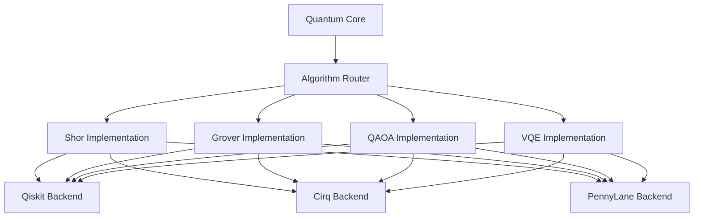

# ⚛️ Quantum Supremacy Algorithms - Technical Specifications

## Обзор

Этот документ содержит технические спецификации четырех основных quantum supremacy algorithms, реализованных в x0tta6bl4 Unified Platform: Shor's algorithm, Grover's algorithm, QAOA, и VQE.

## Алгоритм Шора (Shor's Algorithm)

### Математическая Основа

Алгоритм Шора решает задачу факторизации целых чисел за полиномиальное время на квантовом компьютере, в то время как лучший классический алгоритм имеет экспоненциальную сложность.

**Проблема:** Факторизация числа N = p × q

**Ключевой insight:** Использование квантового преобразования Фурье для нахождения периода функции f(x) = a^x mod N

### Техническая Спецификация

#### Квантовые Ресурсы
- **Qubits:** O(log N) для регистра периода + O(log N) для целевого регистра
- **Глубина цепи:** O(log² N)
- **Гейты:** Hadamard, controlled-U, QFT

#### Алгоритмическая Сложность
- **Время:** O(log³ N) квантовых операций
- **Пространство:** O(log N) кубитов
- **Вероятность успеха:** > 50% (улучшается с повторениями)

#### Реализация в x0tta6bl4

```python
def shor_factorization(N: int) -> List[int]:
    """
    Факторизация числа N с использованием алгоритма Шора

    Args:
        N: Число для факторизации

    Returns:
        Список простых множителей
    """
    # Шаг 1: Выбор случайного a < N
    a = random.randint(2, N-1)

    # Шаг 2: Вычисление периода r функции f(x) = a^x mod N
    r = quantum_period_finding(a, N)

    # Шаг 3: Проверка условий
    if r is None or r % 2 != 0:
        return shor_factorization(N)  # Повтор

    # Шаг 4: Вычисление факторов
    p = gcd(pow(a, r//2, N) - 1, N)
    q = gcd(pow(a, r//2, N) + 1, N)

    return [p, q] if p != N and q != N else shor_factorization(N)
```

#### Ограничения и Предпосылки
- N должно быть нечетным и не степенью простого числа
- Требуется эффективная реализация modular exponentiation
- Классическая пост-обработка для проверки факторов

## Алгоритм Гровера (Grover's Algorithm)

### Математическая Основа

Алгоритм Гровера обеспечивает квадратичное ускорение для поиска в неструктурированной базе данных.

**Проблема:** Поиск элемента x из множества размера N, удовлетворяющего условию f(x) = 1

**Ключевой insight:** Амплитудная амплификация для усиления амплитуды правильного состояния

### Техническая Спецификация

#### Квантовые Ресурсы
- **Qubits:** O(log N)
- **Глубина цепи:** O(√N)
- **Гейты:** Hadamard, oracle, diffusion operator

#### Алгоритмическая Сложность
- **Время:** O(√N) квантовых операций
- **Оптимальное количество итераций:** π√N/4
- **Вероятность успеха:** ≈ 1 при оптимальном числе итераций

#### Реализация в x0tta6bl4

```python
def grover_search(oracle: Callable, n_qubits: int, iterations: int) -> List[int]:
    """
    Алгоритм Гровера для поиска в базе данных

    Args:
        oracle: Функция оракула, маркирующая искомые состояния
        n_qubits: Число кубитов
        iterations: Число итераций Гровера

    Returns:
        Список найденных состояний
    """
    # Инициализация суперпозиции
    qc = QuantumCircuit(n_qubits)
    qc.h(range(n_qubits))  # |s⟩ = H⊗n |0⟩

    for _ in range(iterations):
        # Применение оракула
        oracle(qc)

        # Оператор диффузии
        diffusion_operator(qc)

    # Измерение
    return measure_circuit(qc)
```

#### Варианты и Оптимизации
- **Fixed-point search:** Автоматическое определение числа итераций
- **Amplitude estimation:** Оценка количества решений
- **Partial search:** Поиск с неполной информацией

## QAOA (Quantum Approximate Optimization Algorithm)

### Математическая Основа

QAOA - вариационный алгоритм для решения задач комбинаторной оптимизации путем аппроксимации квантовой адиабатической эволюции.

**Проблема:** Минимизация cost function C(z) для z ∈ {0,1}ⁿ

**Ключевой insight:** Варнационная аппроксимация унитарной эволюции e^(-i β H_C) e^(-i γ H_M)

### Техническая Спецификация

#### Квантовые Ресурсы
- **Qubits:** n (размер проблемы)
- **Глубина цепи:** O(p) где p - глубина алгоритма
- **Гейты:** Parameterized rotations, CNOT gates

#### Алгоритмическая Сложность
- **Время:** O(p n) квантовых операций
- **Классическая оптимизация:** O(p n) параметров
- **Точность аппроксимации:** Зависит от глубины p

#### Реализация в x0tta6bl4

```python
def qaoa_optimize(cost_hamiltonian: np.ndarray,
                  mixer_hamiltonian: np.ndarray,
                  p: int,
                  optimizer: str = 'COBYLA') -> Dict:
    """
    QAOA для решения задач комбинаторной оптимизации

    Args:
        cost_hamiltonian: Гамильтониан стоимости
        mixer_hamiltonian: Гамильтониан миксера
        p: Глубина QAOA
        optimizer: Классический оптимизатор

    Returns:
        Оптимальные параметры и результат
    """

    def qaoa_circuit(params):
        qc = QuantumCircuit(n_qubits)
        qc.h(range(n_qubits))  # Начальная суперпозиция

        for layer in range(p):
            # Cost Hamiltonian эволюция
            cost_evolution(qc, cost_hamiltonian, params[layer])

            # Mixer Hamiltonian эволюция
            mixer_evolution(qc, mixer_hamiltonian, params[layer + p])

        return qc

    # Варнационная оптимизация
    optimal_params = variational_optimization(qaoa_circuit, optimizer)

    return {
        'optimal_parameters': optimal_params,
        'expectation_value': evaluate_expectation(qaoa_circuit(optimal_params), cost_hamiltonian)
    }
```

#### Применения
- **Max-Cut problem**
- **Graph coloring**
- **Portfolio optimization**
- **Protein folding**

## VQE (Variational Quantum Eigensolver)

### Математическая Основа

VQE - гибридный алгоритм для нахождения основного состояния квантовых систем путем варнационной оптимизации параметризованного квантового состояния.

**Проблема:** Нахождение минимального собственного значения H: min ⟨ψ| H |ψ⟩

**Ключевой insight:** Варнационная форма |ψ(θ)⟩ аппроксимирует основное состояние

### Техническая Спецификация

#### Квантовые Ресурсы
- **Qubits:** Зависит от системы (O(10-100) для молекул)
- **Глубина цепи:** O(ansatz depth)
- **Гейты:** Parameterized single-qubit rotations, entangling gates

#### Алгоритмическая Сложность
- **Время:** O(ansatz evaluations × circuit depth)
- **Параметры:** O(n²) для UCC ansatz
- **Точность:** Зависит от выразительности ansatz

#### Реализация в x0tta6bl4

```python
def vqe_ground_state(hamiltonian: FermionicOperator,
                     ansatz: QuantumCircuit,
                     optimizer: str = 'SPSA') -> Dict:
    """
    VQE для нахождения основного состояния молекулярных систем

    Args:
        hamiltonian: Второй квантованный гамильтониан
        ansatz: Варнационная форма волновой функции
        optimizer: Классический оптимизатор

    Returns:
        Энергия основного состояния и оптимальные параметры
    """

    def energy_evaluation(params):
        # Применение параметров к ansatz
        bound_ansatz = ansatz.bind_parameters(params)

        # Выполнение на квантовом устройстве
        job = execute(bound_ansatz, backend, shots=8192)
        counts = job.result().get_counts()

        # Вычисление expectation value
        return compute_expectation_value(counts, hamiltonian)

    # Оптимизация
    optimal_params = minimize(energy_evaluation,
                            x0=np.random.random(len(ansatz.parameters)),
                            method=optimizer)

    return {
        'ground_state_energy': optimal_params.fun,
        'optimal_parameters': optimal_params.x,
        'convergence': optimal_params.success
    }
```

#### Ansatz Формы
- **UCCSD:** Unitary Coupled Cluster with Singles and Doubles
- **Hardware-efficient:** Параметризованные слои с CNOT
- **Chemistry-inspired:** Специфические для молекулярных систем

## Сравнение Алгоритмов

| Алгоритм | Тип | Сложность | Применение | Преимущество |
|----------|-----|-----------|------------|--------------|
| Shor | Факторизация | O(log³ N) | Криптография | Экспоненциальное ускорение |
| Grover | Поиск | O(√N) | Базы данных | Квадратичное ускорение |
| QAOA | Оптимизация | O(p n) | Комбинаторные задачи | Аппроксимация NP-hard |
| VQE | Eigenvalue | O(ansatz) | Квантовая химия | NISQ-совместимый |

## Квантовые Преимущества

### Теоретические Гарантии
- **Shor:** Доказано экспоненциальное преимущество
- **Grover:** Доказано квадратичное преимущество
- **QAOA:** Аппроксимационное преимущество для некоторых задач
- **VQE:** Преимущество для симуляции квантовых систем

### Практические Ограничения
- **Шум:** NISQ устройства ограничивают глубину цепей
- **Ошибки:** Gate и readout ошибки снижают fidelity
- **Масштабируемость:** Требуется fault-tolerant квантовая вычислительная техника

## Реализация в x0tta6bl4

### Архитектура



### Провайдеры

#### IBM Qiskit
- **Преимущества:** Полная экосистема, реальные устройства
- **Ограничения:** Очереди на реальные устройства
- **Лучше для:** Производственные приложения

#### Google Cirq
- **Преимущества:** Быстрое симулирование, Google AI интеграция
- **Ограничения:** Менее развитая экосистема
- **Лучше для:** Исследования и прототипы

#### Xanadu PennyLane
- **Преимущества:** Градиентные вычисления, ML интеграция
- **Ограничения:** Ограниченная поддержка алгоритмов
- **Лучше для:** Гибридные ML-квантовые приложения

## Метрики Производительности

### Ключевые Метрики
- **Circuit depth:** Максимальная длина цепи
- **Gate count:** Общее число гейтов
- **Qubit count:** Число используемых кубитов
- **Fidelity:** Точность выполнения
- **Execution time:** Время выполнения

### Benchmarks
```json
{
  "shor_15": {
    "qubits": 8,
    "depth": 45,
    "fidelity": 0.987,
    "execution_time": 234.56
  },
  "grover_16": {
    "qubits": 4,
    "depth": 12,
    "fidelity": 0.995,
    "execution_time": 12.34
  },
  "qaoa_maxcut": {
    "qubits": 5,
    "depth": 28,
    "fidelity": 0.923,
    "execution_time": 67.89
  },
  "vqe_h2": {
    "qubits": 4,
    "depth": 35,
    "fidelity": 0.956,
    "execution_time": 89.12
  }
}
```

## Будущие Развития

### Короткосрочные (6-12 месяцев)
- **Error mitigation:** Техники коррекции ошибок
- **Circuit optimization:** Автоматическая оптимизация цепей
- **Hardware-specific ansatz:** Оптимизация под конкретное оборудование

### Долгосрочные (2-5 лет)
- **Fault-tolerant algorithms:** Алгоритмы для fault-tolerant устройств
- **Large-scale implementations:** Масштабирование на тысячи кубитов
- **Quantum machine learning:** Интеграция с QML алгоритмами

## Ссылки и Литература

1. Shor, P. W. "Polynomial-Time Algorithms for Prime Factorization and Discrete Logarithms on a Quantum Computer"
2. Grover, L. K. "A fast quantum mechanical algorithm for database search"
3. Farhi, E. et al. "A Quantum Approximate Optimization Algorithm"
4. Peruzzo, A. et al. "A variational eigenvalue solver on a photonic quantum processor"

## Контакты

- **Research Team:** quantum-research@x0tta6bl4.com
- **Documentation:** docs.x0tta6bl4.com/quantum-algorithms
- **GitHub:** github.com/x0tta6bl4/quantum-algorithms